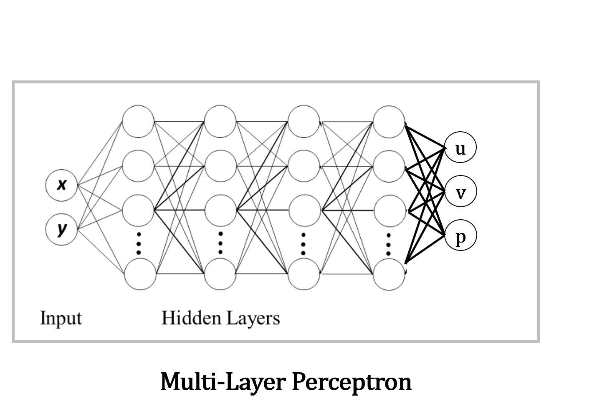
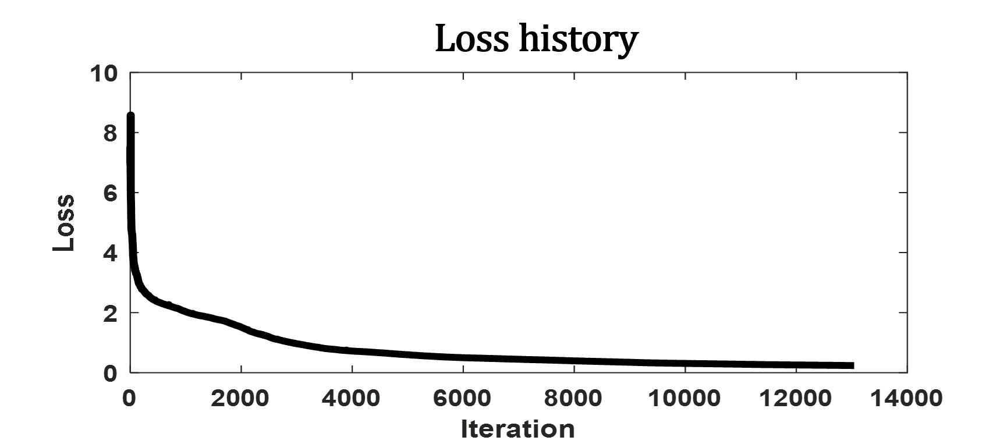
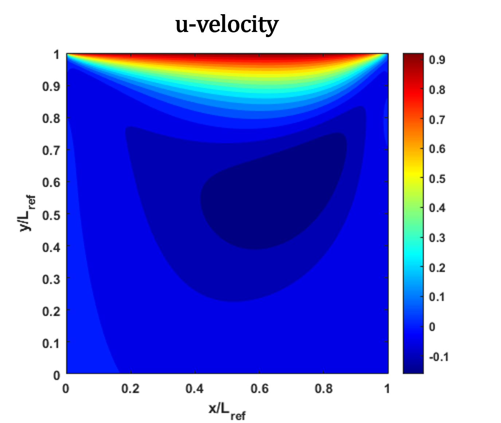
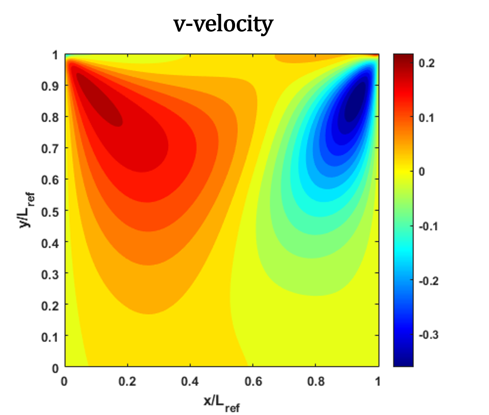
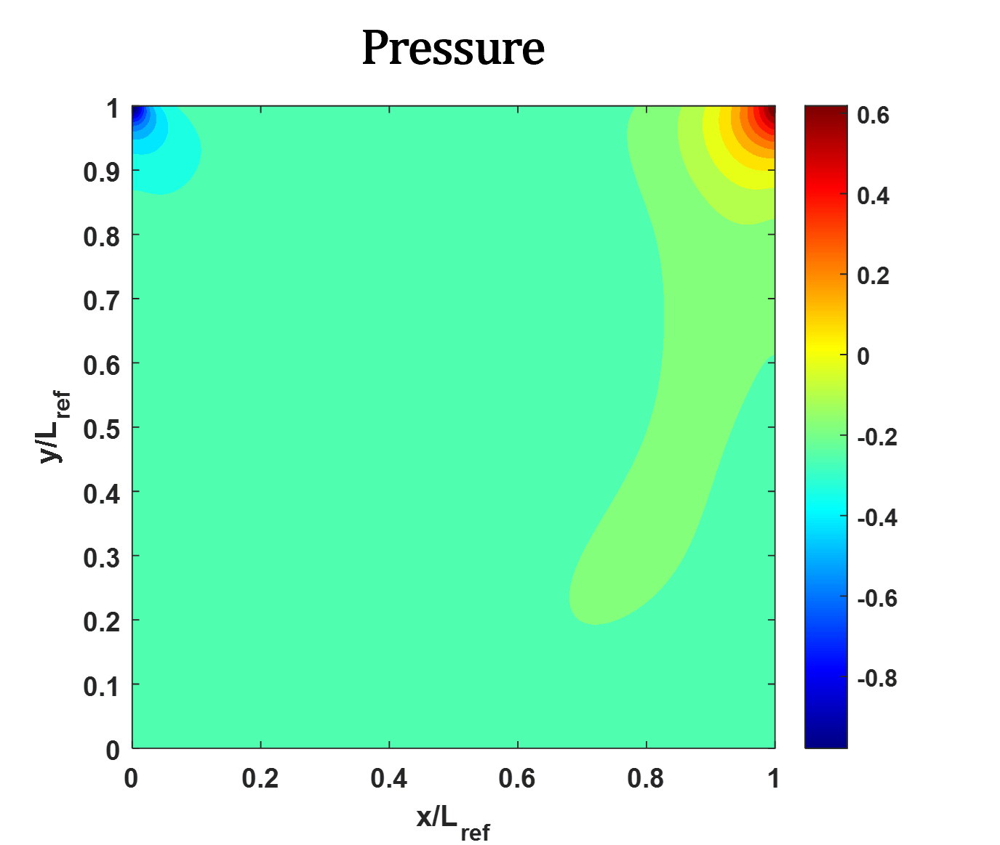

<h1>Instructions</h1>

<h2>Modifying the Model</h2>
<ul>
<li>The NN model is created in Lid_Driven_Cavity.py.</li>
<li>Modifications may be done in this file.</li>
<li>Files named mod_*.py are imported in Lid_Driven_Cavity.py. To keep the main code cleaner and compact, various classes, such as for domain and loss, have been defined in the mod_*.py files.</li>
<li>Before training the model, make sure the variable result_dir is assigned to a directory path (result directory) where the model will be saved.</li>
</ul>

<h2>Result</h2>
<ul>
<li>Post-processing may be done in a separate folder such as in Result_01/.</li>
<li>Copy the NN model class to the file model_class_01.py or in the file post_processing.py before the model is loaded. The model class must be available where the model is loaded back. Here, post_processing.py file imports model_class.py before loading the model.</li>
<li>Model is loaded in the file post_processing.py and data is written in the output files.</li>
<li>The output files are loaded by the MATLAB file plot_result.m for generating plots.</li>
</ul>

<h2>Figures from an example case</h2>

  

  

  

  

  

